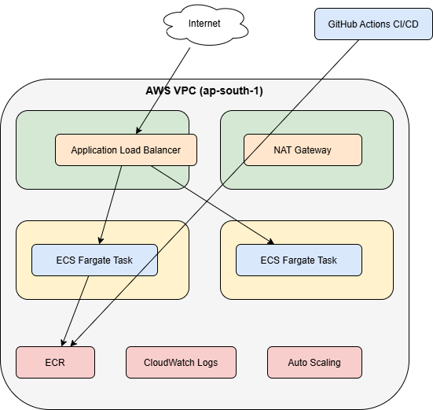

# Cloud Assessment - Mohamed Javith

## Live Application
http://cloud-assessment-alb-226627837.ap-south-1.elb.amazonaws.com

## Architecture Diagram


---

## What I Built

I designed and deployed a production-like cloud setup on AWS for a
simple web application. The app runs in Docker containers on ECS
Fargate, sitting behind an Application Load Balancer. All containers
are in private subnets — the only way in is through the load balancer.
Infrastructure is fully defined in Terraform and deploys automatically
via GitHub Actions on every push.

I chose Mumbai region (ap-south-1) because it gives the lowest
latency for India-based users.

---

## Why I Made These Choices

**Fargate instead of EC2**
I didn't want to manage servers. With Fargate, I define CPU and memory
at the task level and AWS handles everything else. For a small team
this removes a lot of operational overhead — no patching, no node
scaling, no instance failures to deal with.

**Containers in private subnets**
The ECS tasks have no public IP at all. The only entry point is the
ALB. I used security group chaining — the ECS security group only
accepts traffic from the ALB security group ID, not from any IP range.
Even if someone discovers a container's private IP they cannot reach it.

**Two availability zones**
I spread everything across ap-south-1a and ap-south-1b. With
desired_count=2, one task is always running even if an entire AZ
goes down. The ALB also requires minimum two AZs to function.

**ECR over Docker Hub**
Docker Hub rate-limits pulls on free accounts. ECR is inside the
same AWS network as ECS so image pulls are faster. I also enabled
scan_on_push — every image gets automatically checked for known
vulnerabilities when pushed.

---

## Trade-offs I Considered

**NAT Gateway cost**
NAT Gateway costs around $32/month which is disproportionate for
a simple app. I used a single NAT Gateway instead of one per AZ
to cut that cost in half. In production I would replace it with
VPC endpoints for ECR and S3 to eliminate the cost entirely.

**Mutable image tags**
I used mutable tags for simplicity in this assessment. In production
I would use immutable tags with versioned naming so every deployment
is traceable and rollback is straightforward.

**CloudWatch over Prometheus**
I chose CloudWatch basic monitoring because it integrates natively
with ECS and meets the monitoring requirement without additional
infrastructure. For a larger system with custom metrics I would
add Prometheus and Grafana.

**Single NAT Gateway**
One NAT Gateway instead of per-AZ saves ~$32/month. The trade-off
is if the AZ hosting the NAT Gateway goes down, private subnet
outbound access fails. Acceptable for assessment, not for production.

---

## Cost Breakdown

| Resource | Monthly Cost |
|---|---|
| Application Load Balancer | ~$16 |
| ECS Fargate (2 tasks) | ~$10 |
| NAT Gateway | ~$32 |
| ECR Storage | ~$1 |
| CloudWatch Logs | ~$1 |
| **Total** | **~$60/month** |

To keep costs down I set CloudWatch log retention to 7 days instead
of unlimited, and added an ECR lifecycle policy that automatically
deletes old images keeping only the last 5.

Infrastructure will be destroyed after assessment review to stop charges.

---

## CI/CD Pipeline

Every push to main branch automatically:
- Builds the Docker image
- Tags it with the git commit SHA and latest
- Pushes both tags to ECR
- Updates the ECS task definition with the new image
- Deploys with zero-downtime rolling update
- Waits for new tasks to pass health checks before completing

The commit SHA tag means every deployed image is traceable to the
exact code change that triggered it. If something breaks I can
identify the exact commit and roll back.

---

## How to Deploy

```bash
aws configure

cd terraform
terraform init
terraform plan
terraform apply
```

## How to Destroy

```bash
cd terraform
terraform destroy
```

---

## My Background on This

I worked at Basilhut for 1.5 years managing AWS ECS Fargate
deployments for a Hospital Information Management System. HIMS
requires 24/7 availability — similar to what airline operations
systems need. I applied the same private subnet isolation and
multi-AZ patterns I used there.

One thing I noticed during this build — NAT Gateway took about
3 minutes to provision, the longest single resource. That hands-on
experience with provisioning time and the $32/month cost is exactly
why I flagged it as the first optimization target for production.
